# NFC to RFID

**NFC to RFID** is an Android app for Sunmi handheld terminals (L2k / L2s / L2H / L3) equipped
with a UHF RFID module. It copies the UID of an NFC card onto a UHF EPC Gen2 tag, so that the
tag becomes a radio-readable "shadow" of the card: a UHF scan from a distance returns the same
identifier that the card reports over NFC.

Typical use case: assets or badges carry both an NFC card (short-range, secure identification)
and a UHF label (long-range, bulk inventory). This app encodes the labels, keeps them
password-locked against tampering, and verifies that card–tag pairs match.

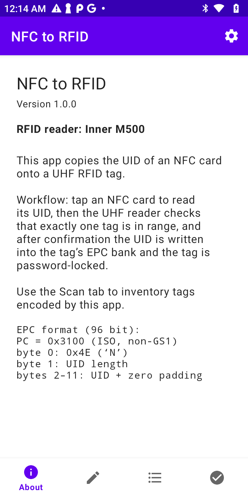

## What the app does

- **Encode** — reads an NFC card's UID, checks that exactly *one* UHF tag is in range, and writes
  the UID into the tag's EPC memory bank (with confirmation before every write).
- **Lock** (optional, on by default) — after writing, the tag is protected: an access password and
  a kill password are set, and the EPC, access-password and kill-password banks are locked.
  Re-encoding a locked tag is only possible with the configured access password.
- **Scan** — bulk inventory of tags encoded by this app, with live pairing validation against
  tapped NFC cards.
- **Validate** — one-by-one check: tap a card, get an immediate PAIRED / TAG MISSING verdict.
- **NXP originality check** — on every card tap the app reads the NXP originality signature
  (DESFire family over ISO-DEP, NTAG21x/Ultralight over NFC-A) and verifies it against NXP's
  public keys. This proves the silicon is a genuine NXP chip — it does **not** prove the card
  belongs to your system. An invalid signature pauses the workflow with a warning dialog.

Feedback is designed for warehouse use: distinct success/error tones, vibration, and a
full-screen green/red flash visible from the corner of your eye.

## Requirements

| Component | Requirement |
|---|---|
| Device | Sunmi handheld with UHF module (UHF R2000 handle, Inner M500, UHF S7100, Inner SIM3500) |
| Service | Sunmi scanner service (`com.sunmi.scanner`) — preinstalled on Sunmi devices |
| Cards | NFC-A: MIFARE Classic/Ultralight, NTAG, DESFire (UID 4, 7 or 10 bytes). Cards with random UIDs (e.g. bank cards) are rejected |
| Tags | EPC Gen2 (ISO 18000-6C) with a 96-bit EPC bank — e.g. Impinj Monza R6, M730/M750, NXP UCODE 8/9 |

## EPC encoding format

The EPC is 96 bits (12 bytes, 6 words) and is written together with a new PC word, so encoding
works regardless of the tag's previous EPC length:

```
PC word = 0x3100        L = 6 words; T (toggle) = 1 → non-GS1 / ISO namespace, AFI = 0x00
byte 0     = 0x4E       application magic ('N')
byte 1     = UID length 0x04 / 0x07 / 0x0A
bytes 2–11 = UID bytes, left-aligned, zero-padded
```

Example: card UID `74:0B:2A:EB` (4 bytes) → EPC `4E04740B2AEB000000000000`.

Design notes:

- The T bit in the PC word declares the tag as a **non-GS1** identifier (ISO 15961), so the
  encoding can never collide with present or future GS1 EPC schemes. GS1-conformant software
  represents such tags as `urn:epc:raw:...` instead of failing to decode.
- Some tag chips do not persist the T/AFI bits of a written PC word. This is harmless — decoding
  keys on the `4E` prefix and the UID length byte, and post-write verification compares the EPC
  only.
- Two tags carrying the identical EPC look like one entry during inventory. The write sequence
  detects this after the fact: if the *old* EPC is still in the field after a successful write,
  the app reports a duplicate-tag error.

## Using the app

The bottom navigation has four tabs — **About**, **Encode**, **Scan**, **Validate** — plus a
settings gear in the top bar. The About tab shows the app version, the detected UHF reader
model and a summary of the encoding format.

### Encoding a tag (Encode tab)

1. **Tap the NFC card.** The UID and the NXP originality status appear in step 1. A short beep
   confirms the tap was registered.
2. **UHF tag check.** The app scans for the configured duration (default 3 s) and requires
   exactly one tag in range. Zero or multiple tags stop the workflow with an error — isolate a
   single tag and press *Scan again*.
3. **Confirm the write.** The screen shows the tag's current EPC (with RSSI) and the new EPC to
   be written. If the tag already carries a UID from a *different* card, an overwrite warning is
   shown. Press **Write tag**.
4. The app writes the EPC, sets the passwords, locks the tag (when locking is enabled), and
   verifies the result by reading the tag back. Success is signalled with a green flash.

| 1. Waiting for card | 2. UHF check | 3. Confirmation |
|---|---|---|
| 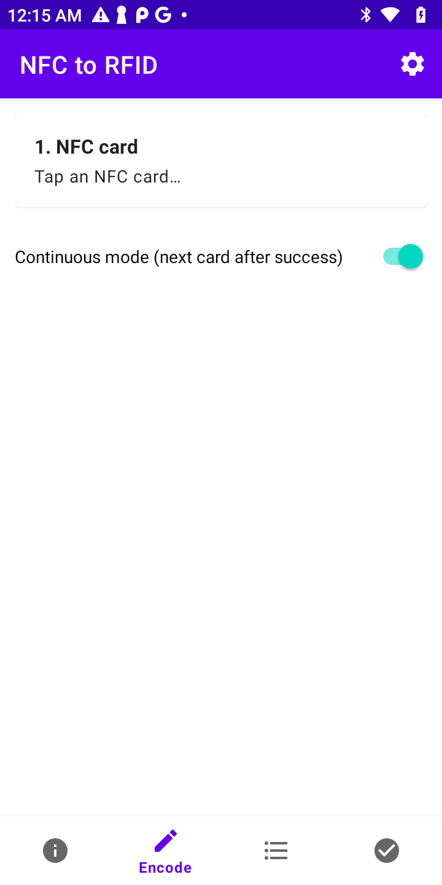 | 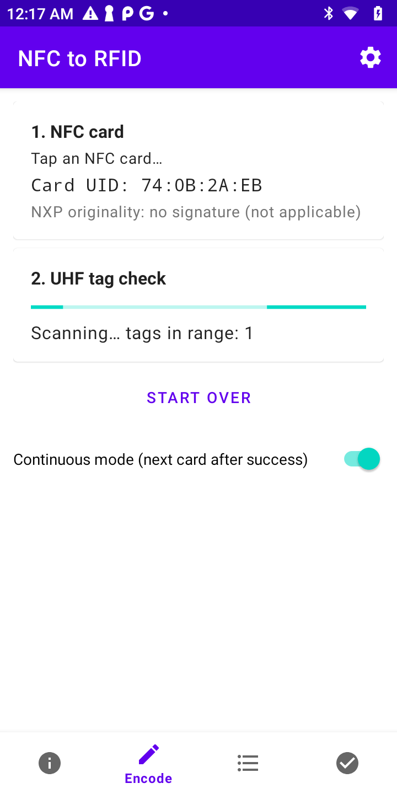 | 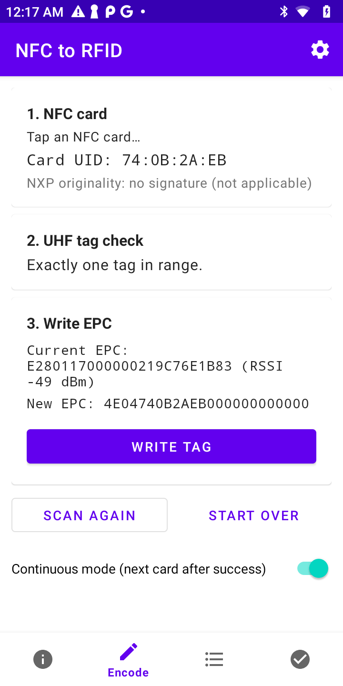 |

| 4. Success | Already encoded |
|---|---|
| 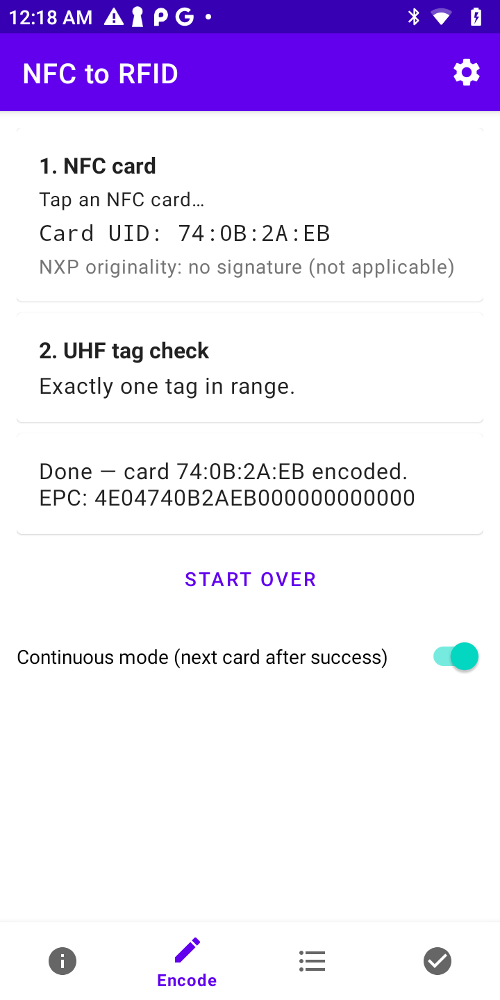 | 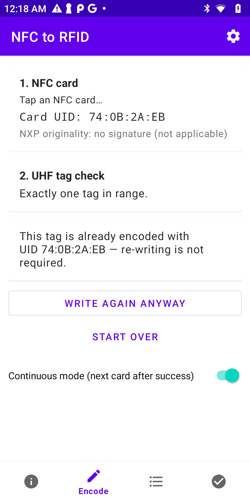 |

Notes:

- **Continuous mode** returns to step 1 automatically two seconds after a success — convenient
  for encoding a batch of cards.
- If the scanned tag already carries this card's UID, the app reports *"re-writing is not
  required"* instead of writing. With locking enabled it silently completes any missing
  passwords/locks first (this also repairs tags left half-secured by an interrupted write).
  **Write again anyway** forces a full re-write.
- If a write fails mid-sequence (e.g. the tag left the field), simply scan again — the workflow
  re-reads the tag's current state and the whole sequence is safe to re-run.

### Bulk inventory and validation (Scan tab)

Press **Start scan** or hold the device's **trigger key** to run a continuous UHF inventory.
Tags encoded by this app are listed with their decoded UID, live RSSI and read count; foreign
tags are only counted, not listed. The list accumulates between scans — **Clear** resets it,
**Share** exports the UID list (one per line) via the system share sheet.

Tapping NFC cards while on this tab validates card–tag pairs:

- Card whose tag has been seen over UHF → entry turns **green** (*Paired*), success signal.
- Card without a matching UHF read → **red** entry pinned to the top (*missing tag*), and it
  turns green automatically once a scan reads the tag.

| Empty | Inventory | Paired (green) | Missing (red) |
|---|---|---|---|
| 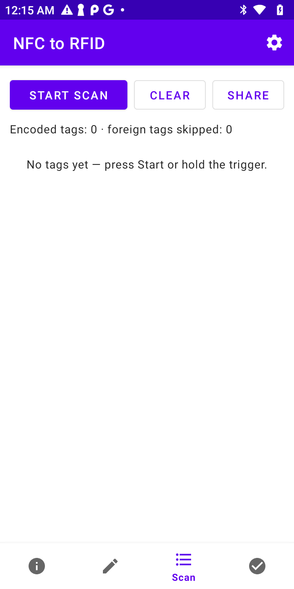 | 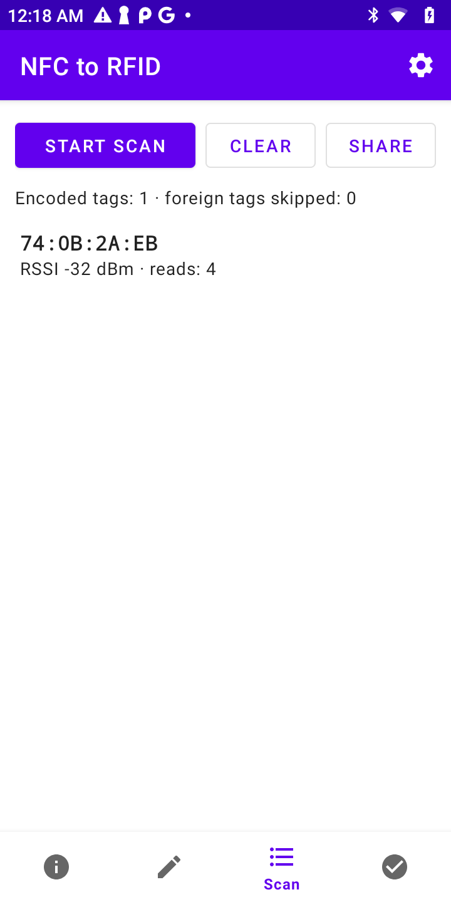 | 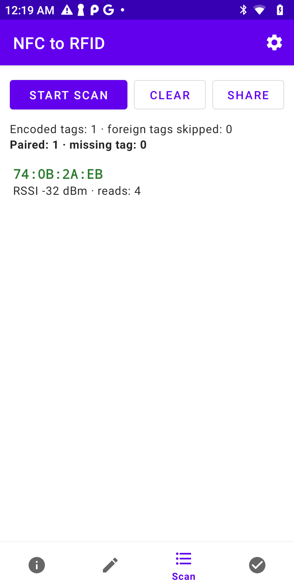 | 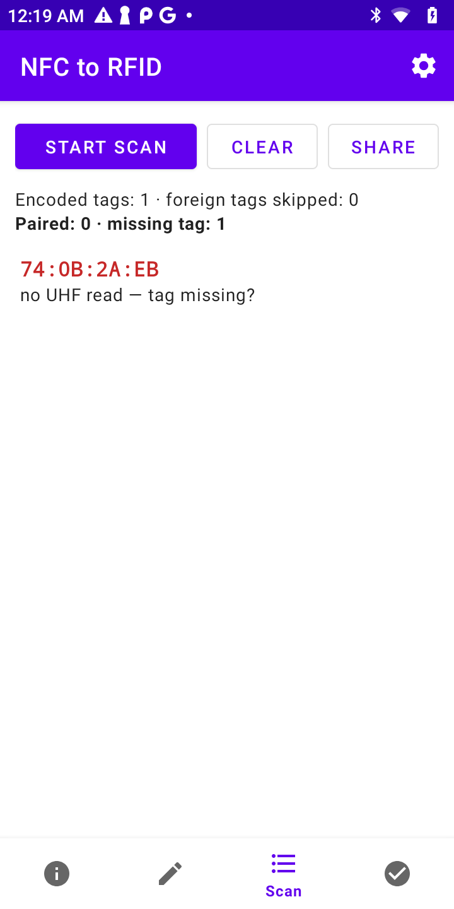 |

### One-by-one validation (Validate tab)

Tap a card — the app searches for a tag carrying exactly that card's EPC and shows a
full-screen verdict: green **PAIRED** (with the tag's RSSI) or red **TAG MISSING**. The card's
NXP originality status is shown underneath. The screen is immediately ready for the next card.

| Idle | Searching | Paired | Missing |
|---|---|---|---|
| 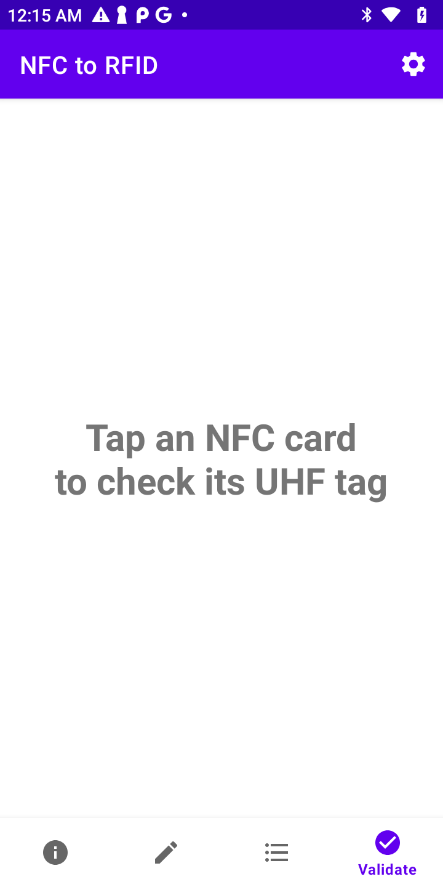 | 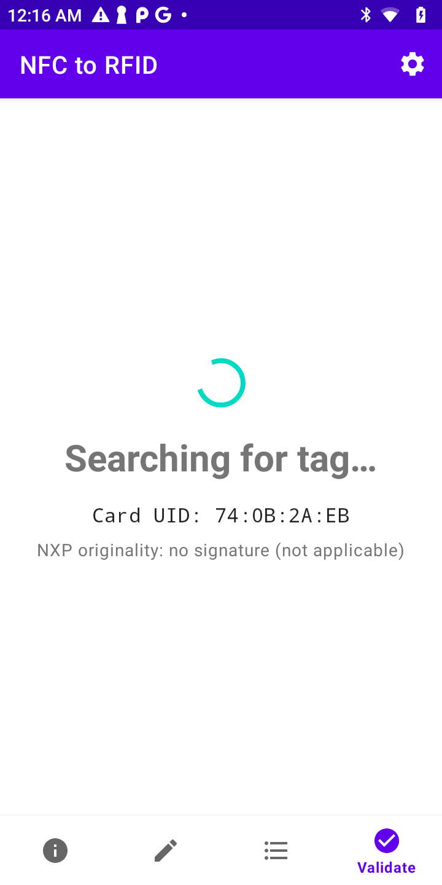 | 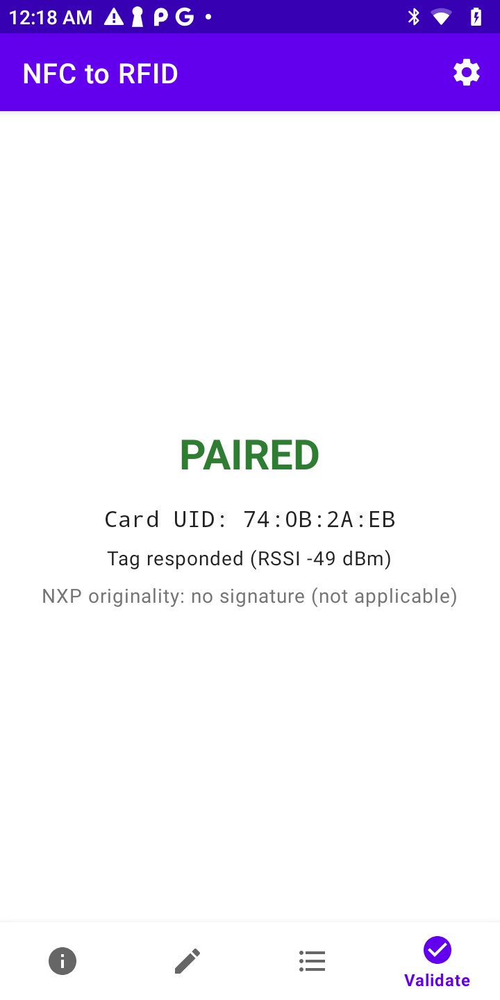 | 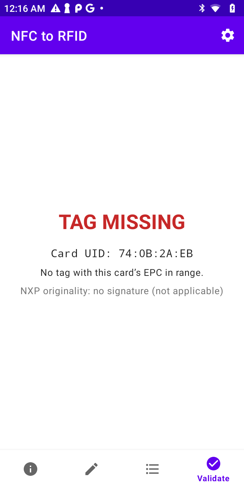 |

### Settings

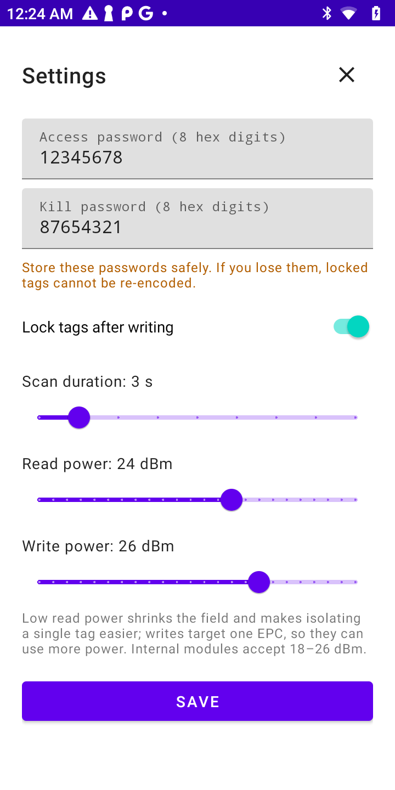

| Setting | Default | Description |
|---|---|---|
| Access password | — | 8 hex digits. Used to lock tags and to re-encode tags locked by this app |
| Kill password | — | 8 hex digits. Written to the tag so nobody else can set one and kill the tag |
| Lock tags after writing | on | Requires both passwords to be set and non-zero |
| Scan duration | 3 s | Length of the UHF check in the Encode workflow and the Validate search window |
| Read power | 20 dBm | Inventory power. Keep it low — a small field makes isolating a single tag easier |
| Write power | 26 dBm | Power used for write/lock operations. Writes target one EPC, so more power is safe. Internal modules accept 18–26 dBm |

> **Store the passwords safely.** A tag locked with a lost access password cannot be re-encoded.

## Troubleshooting

| Symptom | Cause / fix |
|---|---|
| *Found N tags — leave exactly one tag in range* | More than one tag answered during the check. Move other tags away or lower the read power |
| *The tag left the field during the operation* | Hold the tag close to the reader and scan again; the sequence is safe to re-run |
| *Access failed / Write failed — locked with a different password* | The tag was locked with a password other than the configured one. Without that password the tag cannot be re-encoded |
| *A tag with the old EPC is still in range* | Two tags carried the identical EPC and only one took the write. Remove one and scan again |
| *NXP originality: could not read signature* | The card was pulled away too quickly — hold it on the reader a moment longer |
| *NXP originality: INVALID signature* | The signature does not match any known NXP key — possible counterfeit chip. The app asks whether to continue |
| *RFID reader: not detected* (About tab) | UHF module not present/attached, or the Sunmi scanner service is unavailable |

## Development

- Build: `./gradlew :app:assembleDebug` (AGP 9 with built-in Kotlin, JDK 17+; the Sunmi
  `SunmiScannerSdk` AAR is bundled in `app/libs/`).
- Unit tests: `./gradlew :app:testDebugUnitTest`.
- CI: pushes and PRs build the APK (`.github/workflows/build.yml`); the release workflow
  (`.github/workflows/release.yml`) bumps the version, tags `vX.Y.Z` and publishes the APK to
  GitHub Releases. Release signing uses the single `RELEASE_SIGNING` JSON secret; without it the
  APK is debug-signed.
